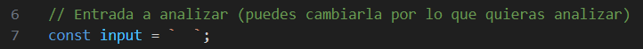
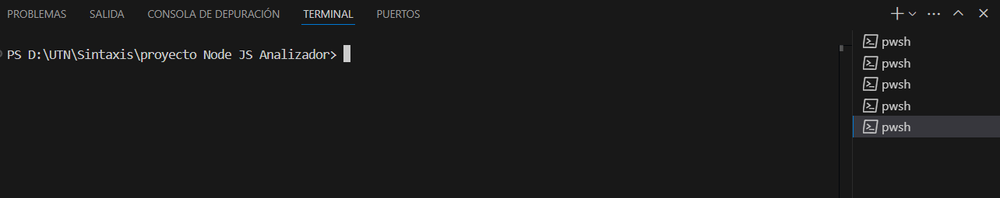

INSTALACIÓN

Clone el siguiente repositorio: 
Para ello: 
    1. Abre una Terminal (en VS CODE) o en la Consola de Comandos, CMD (con WINDOWS+R)
        
    2. Selecciona y ubicate en la carpeta donde quieras tener el proyecto (por ejemplo, tu Escritorio o una carpeta de proyectos), como
        Ejemplo: cd C:\Users\TuUsuario\Desktop
                 cd D:\UTN\Sintaxis
        
    3. Copia el siguiente Comando
    
        git clone https://github.com/amaro-pm/52082.git

    4. Pegue y Ejecutelo (con Enter) en la Terminal que haya abierto
    
    5. Una vez clonado, encontrara una nueva carpeta llamada
    
        cd 52082
        
       con todo el contenido del repositorio dentro de la carpeta donde ejecutaste el comando.
    
      

INSTRUCCIONES PARA EJECUTAR EL ANALIZADOR 

PRIMER PASO:
    
    Crea un Archivo de Texto, con el nombre que eligas, pero que tenga la terminación ".txt" (ejemplo: input.txt)

    En este, escribe la "Entrada" que quieres que el Analizador, justamnete, analice: Lexica y Sintacticamente, generando su Tabla de Lexemas y Tokens; y ademas su Arbol de Derivación

    IMPORTANTE: Este Analizador ACEPTA Entradas como

    Declaración de Variables:
    variable x = 2;
    variable nombre = 'Juan';

    Impresiones:
    imprimir x;
    imprimir 'Hola';

    Operaciones de texto:
    x = mayusculas('hola');
    nombre = invertir(nombre);

    Concatenaciones: 
    nombre = 'Juan' + ' Perez';

    Funciones: 
    funcion saludar(nombre) {
    imprimir nombre;
    }

    Retornos:
    devolver x;

    pero, tomo como ERROR o NO ACEPTA Entradas del tipo:

    Faltan punto y coma
    variable x = 2
    imprimir x

    Declaraciones incompletas
    variable = 2;
    variable x = ;

    Impresion sin valor
    imprimir ;

    Operaciones de texto mal tomadas
    x = mayusculas 'hola';
    x = invertir();

    Palabras no reconocidas (hay palabras Reservadas, como las mostradas, que no estan en la gramatica)
    mostrar x;
    var x = 2;

    Cadenas sin comillas SIMPLES
    variable nombre = Juan;

    Luego de escribir su Entrada a Analizar (RECUERDE de guadrar lo escrito con CTRL+S), Copie la mismsa y debe de dirigirse  y elegir en el Panel Izquierdo el archivo "index.js". En el mismo, con su entrada copiada, la pega en el bloque de:

    const input : `  ` (la entrada va entre las comillas invertidas, separando cada instrucción un renglon abajo y NO OLVIDAR escribir ; al final de cada linea de código)

    Ejemplo: const input = `  
            variable x = 2;
            variable y = 3;
            imprimir 'Hola mundo';
            imprimir x;
            x = mayusculas('texto');
            y = invertir('abc');
            `;
 

    Despues, recordnado guardar tambien, dirigase al panel izquierdo; y busque y eliga el archivo "launch.json". Busque la línea de codigo:

    "input": "  "

    y entre las comillas dobles, debe de escribir el nombre del archivo .txt que eligio, debe escribir EL NOMBRE QUE ELIGIO JUNTO CON LA TERMINACIÓN .txt (RECUERDE guardar con CTRL+S).

    De ahi busque en el panel izquierdo el archivo "Analizador.g4"; y puede ver:

        - El Arbol de Derivación apretando la teclas "Fn+F5", generandose una ventana al lado del archivo "Analizador.g4" en donde se muestra el Arbol completo (puede agrandar la ventana o elegirla). Importante mencionar: las teclas para ver el arbol deben de ser Ejecutadas en el archivo "Analizador.g4", sino no se lo mostrara.

        - La Tabla de Lexemas y Tokens, el Analisis Sintactico de su entrada, para ello; Debe de ir al nael de arriba y Seleccionar y dar Click en los "tres Puntitos" (estan al lado del Ejecutar), mover la flecha a la opción "Temrinal" y luego dar click en "Nueva Terminal".

        De ahí, se le abrira una Ventana por debajo del docuento donde le aparecera este código:

           " PS D:\UTN\Sintaxis\proyecto Node JS Analizador> " 

 

        delante de el aparece un cuadrado blanco o cuando da click en este (como si quisiera escribir) y ahi debe de escribir lo siguiente: "node index.js", lo escribe y da Enter en su teclado y le Generara y Mostrara el
            1. la Tabla de Tokens y Lexemas (con su Tipo, Código y Lexema)
            2. el Árbol de análisis sintáctico
            3. el Análisis Sintáctico de su entrada, si esta Bien; le correra normal, pero si esta Mal; le aparecera Uno o Varios mensajes de <mising> en donde esta el error (de escritura, traducción, léxico, etc)
            4. Interpretación
            5. Traducción de su entrada a "JavaScript"
